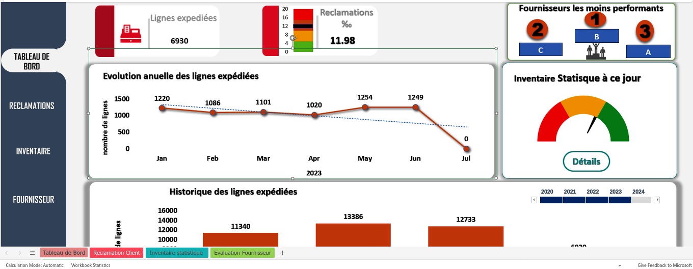

Excel Dashboard for KPI Visualization 
====================================================
 

<image:: https://img.shields.io/pypi/v/qtpylib.svg?maxAge=60>
    :target: https://pypi.python.org/pypi/qtpylib
    :alt: PyPi version

.. image::https://img.shields.io/pypi/status/qtpylib.svg?maxAge=60
    :target:https://pypi.python.org/pypi/qtpylib
    :alt: PyPi status

.. image:: https://img.shields.io/travis/ranaroussi/qtpylib/main.svg?maxAge=1
    :target: https://travis-ci.org/ranaroussi/qtpylib
    :alt: Travis-CI build status

.. image:: https://img.shields.io/badge/docs-latest-brightgreen.svg?style=flat
    :target: http://qtpylib.io/docs/latest/?badge=latest
    :alt: Documentation Status

.. image:: https://img.shields.io/badge/Chat-Discord-%237289d6.svg?style=flat&logo=discord&maxAge=60
    :target: https://discord.gg/7wEzsuV
    :alt: Chat on Discord

.. image:: https://img.shields.io/github/stars/ranaroussi/qtpylib.svg?style=social&label=Star&maxAge=60
    :target: https://github.com/ranaroussi/qtpylib
    :alt: Star this repo

.. image:: https://img.shields.io/twitter/follow/aroussi.svg?style=social&label=Follow&maxAge=60
    :target: https://twitter.com/aroussi
    :alt: Follow me on twitter

\

Please click on the link to view the file :

 ### [See Project](https://github.com/PeJiR/Excel/blob/522ab992163bfec3d395231a177d3b21e8171e19/KPI%20dashboard.%20-%20Editable.xlsb) 
 
This Excel dashboard helps businesses to visualize and analyze key performance indicators (KPIs) such as customer complaints and defects, inventory control, and supplier evaluation. The dashboard is customizable and can be filtered by date range, product category, or other criteria.

**Benefits:**

- Identify areas for improvement
- Set goals and track progress
- Improve performance in a variety of areas

**Examples:**

- Customer service managers can track the number of customer complaints by type and product category to identify the most common complaints and develop strategies to reduce them.
- Supply chain managers can track supplier performance metrics to identify the best performing suppliers and negotiate better terms.
- Sales managers can track sales revenue by product category and region to identify the best performing products and regions and develop strategies to increase sales in other areas.

The Excel Dashboard for KPI Visualization is a valuable tool for businesses of all sizes to improve their performance.

  

The file is available for free download.
